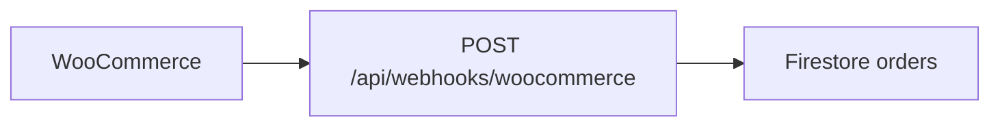
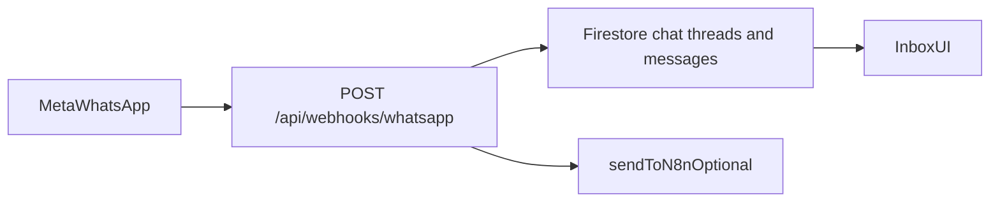
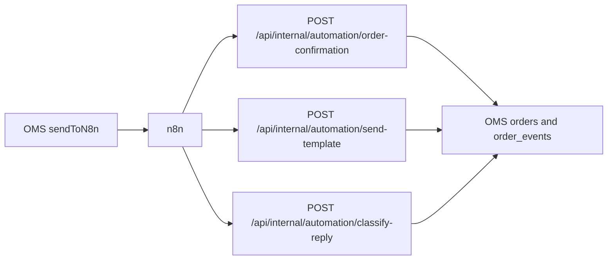

# مرجع المشروع (عربي) — Store OMS

ملخص تشغيلي: بدء سريع، متغيرات البيئة، اختبار واتساب، استكشاف أخطاء، أمان، ومخططات تدفق. للشرح الطويل خطوة بخطوة راجع [handbook-ar.md](./handbook-ar.md). للمستودع بالإنجليزية راجع [README.md](../README.md).

---

## Quick Start

1. **المتطلبات:** Node.js (انظر `package.json`)، ومشروع Supabase مع Postgres/Auth.
2. **نسخ البيئة:**
   ```bash
   cp .env.example .env.local
   ```
3. **تعبئة الحد الأدنى للتشغيل مع Supabase:** ضع `SUPABASE_URL` و`SUPABASE_ANON_KEY` و`SUPABASE_SERVICE_ROLE_KEY`، وللمتصفح `NEXT_PUBLIC_SUPABASE_URL` و`NEXT_PUBLIC_SUPABASE_ANON_KEY`.
4. **التثبيت والتشغيل:**
   ```bash
   npm install
   npm run dev
   ```
5. **وضع بدون قاعدة بيانات (تجريبي):** عيّن `DEV_MOCK_DATA=true` لبيانات وهمية في الذاكرة (انظر `lib/dev/`). استخدم tenant مثل `default` حسب الوثائق.
6. **فحوصات مفيدة:** `npm run build`، `npm test`، `npm run lint`.

---

## جدول متغيرات البيئة (كامل)

| Variable | Purpose (EN) / الغرض (عربي بسيط) |
|----------|-----------------------------------|
| `SUPABASE_URL` | Supabase project URL for server-side clients. |
| `SUPABASE_ANON_KEY` | Supabase anon/publishable key for session-aware server operations. |
| `SUPABASE_SERVICE_ROLE_KEY` | Supabase service role key for trusted server-only persistence. **لا تضعه في الواجهة.** |
| `NEXT_PUBLIC_SUPABASE_URL` | Supabase project URL for browser auth client. |
| `NEXT_PUBLIC_SUPABASE_ANON_KEY` | Supabase anon/publishable key for browser auth client. |
| `NEXT_PUBLIC_APP_URL` | Public HTTPS base for webhooks/links (e.g. `https://oms.example.com`). **رابط الموقع العام**؛ يُفضّل في الإنتاج. |
| `NEXT_PUBLIC_DEFAULT_TENANT_ID` | Default tenant id for local UI demos when no `X-Tenant-Id` (see `store/zustand/session-store.ts`). |
| `WOOCOMMERCE_WEBHOOK_SECRET` | Optional global HMAC fallback for Woo webhooks; **يُفضّل** سر لكل شركة من Settings → Integrations. |
| `WOOCOMMERCE_STORE_RAW_PAYLOAD` | When set to `1`, persist raw Woo JSON under `orders/{id}/webhook_snapshots/{deliveryId}` (see `lib/config/env.ts`). |
| `BOSTA_API_KEY` | Optional server-wide Bosta API key fallback. |
| `BOSTA_BASE_URL` | Bosta API host (URL), e.g. `https://app.bosta.co`. |
| `DEV_MOCK_DATA` | When truthy, in-memory mock backend. **وضع تجريبي محلي.** |
| `PLATFORM_ADMIN_SECRET` | Bearer secret for `/api/platform/*` super-admin routes. |
| `UPSTASH_REDIS_REST_URL` | Upstash REST URL for optional API rate limiting (`lib/http/api-rate-limit.ts`). |
| `UPSTASH_REDIS_REST_TOKEN` | Upstash REST token. |
| `WHATSAPP_APP_SECRET` | Meta app secret for inbound webhook `X-Hub-Signature-256` verification; tenant may override via `integrations.whatsapp.appSecret`. |
| `AUTOMATION_SECRET` | Bearer token for `/api/internal/automation/*` and related automation entry routes. **لا تضعه في الواجهة.** |
| `N8N_HMAC_SECRET` | Default HMAC secret when signing outbound payloads to n8n (tenant may set `automation.n8nWebhookSecret`). |
| `N8N_DEFAULT_WEBHOOK_URL` | Fallback n8n webhook URL when tenant `automation.n8nWebhookUrl` is unset. |
| `VERCEL_URL` | Set automatically on Vercel; used with `serverPublicBaseUrl()` when `NEXT_PUBLIC_APP_URL` is empty (`lib/config/public-url.ts`). **runtime — لا حاجة لنسخه يدوياً على Vercel عادة.** |
| `NODE_ENV` | Standard Node/Next environment (`development` / `production`). |

**لا تضع أسراراً حقيقية في الوثائق أو في commits.** استخدم قيماً نائبة في الإعدادات فقط.

---

## WhatsApp testing checklist

| Step | What to verify |
|------|----------------|
| 1 | في Meta: **Callback URL** = `https://<your-domain>/api/webhooks/whatsapp?tenant=<tenantIdOrSlug>` كما في [whatsapp-inbox.md](./whatsapp-inbox.md). |
| 2 | **GET** verification: `hub.verify_token` يطابق `integrations.whatsapp.verifyToken` المحفوظ من Settings → Integrations. |
| 3 | اشترك في **`messages`** و **`message_status`** على الويبهوك. |
| 4 | **POST** وارد: التوقيع `X-Hub-Signature-256` يطابق `WHATSAPP_APP_SECRET` أو `integrations.whatsapp.appSecret`. |
| 5 | أرسل رسالة تجريبية؛ تحقق من ظهور المحادثة في **Inbox** (`/inbox`) ومن تحديث `chat_conversations` / `chat_messages` في Supabase إن لزم. |
| 6 | **POST** `/api/whatsapp/send-message` مع جسم `{ "conversationId", "body" }` وصلاحية `inbox:write` (انظر [whatsapp-inbox.md](./whatsapp-inbox.md)). |
| 7 | إذا `whatsappAutomationEnabled` و`n8nWebhookUrl`: راقب أحداث n8n وتحقق من `X-OMS-Signature` حسب [n8n-whatsapp-automation.md](./n8n-whatsapp-automation.md). |
| 8 | اختياري: عند تفعيل **Inline keyword classifier** في Settings → Automation (`inlineReplyClassifier`)، يُسجَّل `chat.classified` على الطلب ويُرسل حدث `chat.reply.classified` إلى n8n؛ مسار استقبال تصنيف خارجي: `POST /api/internal/automation/classify-reply` مع `Authorization: Bearer <AUTOMATION_SECRET>`. |

---

## Troubleshooting

| Symptom / الرسالة | ماذا تفعل |
|-------------------|-----------|
| `SUPABASE_SERVICE_ROLE_KEY is not set` | عيّن مفاتيح Supabase في `.env.local` أو استخدم `DEV_MOCK_DATA=true` للتجارب. |
| ويبهوك واتساب 401 / رفض التوقيع | تأكد من تطابق **App secret** مع Meta: env `WHATSAPP_APP_SECRET` أو حقل الشركة `appSecret`. |
| ويبهوك Woo 401 أو رفض | تحقق من HMAC ومن معامل **`tenant`** في الرابط (انظر [webhook-ingestion.md](./webhook-ingestion.md)). |
| روابط Callback فارغة أو خاطئة | عيّن `NEXT_PUBLIC_APP_URL`؛ على Vercel غالباً يكفي `VERCEL_URL` كبديل عبر `serverPublicBaseUrl()`. |
| استعلام Supabase بطيء أو مرفوض | راجع migration indexes وRLS policies في `supabase/migrations`. |
| n8n لا يستقبل أحداثاً | تحقق من `whatsappAutomationEnabled`، من URL السر، ومن سجلات `automation_runs` إن وُجدت. |

---

## Security notes

- **`AUTOMATION_SECRET`** و**tokens واتساب** و**مفاتيح Woo/Bosta** أسرار خادم فقط — لا تُعرَّض في `NEXT_PUBLIC_*` ولا في المتصفح.
- مسارات **`/api/internal/automation/*`** مخصصة لـ Bearer token (`AUTOMATION_SECRET`)؛ لا تربطها بواجهة عامة بدون بوابة.
- أحداث **OMS → n8n** موقّعة بـ **`X-OMS-Signature`** (HMAC)؛ يجب التحقق في n8n كما في [n8n-whatsapp-automation.md](./n8n-whatsapp-automation.md).
- **عزل المستأجر:** كل الكتابات تمر عبر خدمات تفرض `tenantId`؛ الصلاحيات في [lib/auth/rbac.ts](../lib/auth/rbac.ts).
- **`STAFF_AUTH_MODE=firebase`:** يقيّد قبول مفاتيح الموظفين القديمة (`staffApiKey`) عند التهيئة الصحيحة (انظر الدليل الطويل).

---

## مخططات تدفق (Mermaid)

### WooCommerce → OMS



### WhatsApp (Meta) → OMS



### n8n ↔ OMS (automation)



---

## وثائق ذات صلة

- [handbook-ar.md](./handbook-ar.md) — الدليل العربي المفصّل  
- [whatsapp-inbox.md](./whatsapp-inbox.md) — Inbox و APIs  
- [n8n-whatsapp-automation.md](./n8n-whatsapp-automation.md) — أحداث وتوقيع n8n  
- [webhook-ingestion.md](./webhook-ingestion.md) — استيعاب الويبهوكات  
- [data-model.md](./data-model.md) — نموذج البيانات  

*آخر تحديث يتوافق مع `lib/config/env.ts` و`.env.example` في المستودع.*
