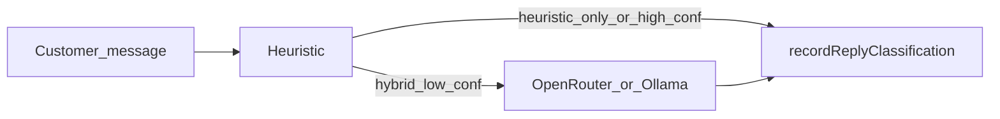

# AI intent pipeline / مسار نوايا الردود

## Providers (technical)

Implemented in [`lib/services/ai/intent-classifier.service.ts`](../lib/services/ai/intent-classifier.service.ts).

1. **heuristic** — keyword buckets (`lib/logic/reply-intent-classify.ts`).
2. **openrouter** — Chat Completions API; env `OPENROUTER_API_KEY`, `OPENROUTER_MODEL`.
3. **ollama** — `/api/chat`; env `OLLAMA_BASE_URL`, `OLLAMA_MODEL`.

Tenant settings (`TenantAutomationSettings`):

- `inlineReplyClassifier` — run pipeline on inbound WhatsApp when order linked.
- `replyIntentClassifierProvider` — `heuristic` \| `openrouter` \| `ollama` \| `hybrid`.
- `replyIntentClassifierLlmThreshold` — in **hybrid**, call LLM when heuristic confidence is below this (default `0.72`).

## Canonical intents

`confirm`, `cancel`, `address_change`, `ask_shipping`, `complaint`, `greeting`, `return_request`, `exchange_request`, `unknown`.

External automation may POST structured results to `/api/internal/automation/classify-reply` (Bearer `AUTOMATION_SECRET`).

## Operational (AR)

- **الهجين**: يقلل تكلفة LLM ويحافظ على سرعة الرد للعبارات الواضحة.
- **التصعيد**: منطق التصعيد للبشر موجود في `reply-classification.service.ts` (عتبة ثقة + `unknown`).

## Troubleshooting

- LLM always `unknown`: check API keys / model names / JSON-only prompt failures in logs.
