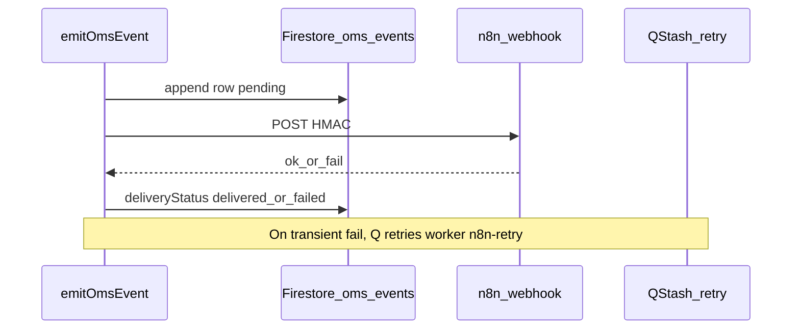

# Automation events (`oms_events`) / أحداث الأتمتة

## Event envelope (technical)

Firestore collection: `oms_events` (append-only semantics; delivery fields may be merged).

| Field | Purpose |
|-------|---------|
| `tenantId` | Tenant scope |
| `eventType` | Same string as n8n `event` |
| `occurredAt` | ISO timestamp |
| `correlationId` | Trace id; duplicated under `payload.metadata.correlationId` |
| `source` | `api` \| `webhook` \| `worker` \| `cron` \| `system` |
| `payload` | Full n8n-oriented JSON |
| `deliveryStatus` | `pending` \| `delivered` \| `failed` |
| `retryCount` | Incremented on failed n8n attempts |
| `lastDeliveryError` | Short error snippet |

## Required event types (identifiers)

Aligned with `N8nOmsEventType` in code and [`lib/constants/n8n-oms-events.ts`](../lib/constants/n8n-oms-events.ts):

- `whatsapp.message.received`, `whatsapp.message.sent`
- `order.confirmation.requested`, `order.confirmed`, `order.cancelled`
- `conversation.assigned`, `conversation.needs_human`
- `conversation.transferred`, `conversation.escalated`, `conversation.followup_scheduled`
- `sla.warning`, `sla.breached`
- `shipment.created`, `ticket.created`
- `chat.reply.classified`

## Flow

## Operational (AR)

- **التدقيق**: صف `oms_events` هو المرجع لما حدث فعلياً حتى لو فشل n8n.
- **التصحيح**: راقب `retryCount` و `lastDeliveryError` ثم `automation_dlq` بعد نفاد إعادة QStash.

## Internal auth

| Route | Header / verification |
|-------|------------------------|
| `/api/internal/automation/*` | `Authorization: Bearer AUTOMATION_SECRET` |
| `/api/internal/workers/*` | QStash signature |
| `/api/cron/inbox-sla` | `Authorization: Bearer CRON_SECRET` (prod) |
