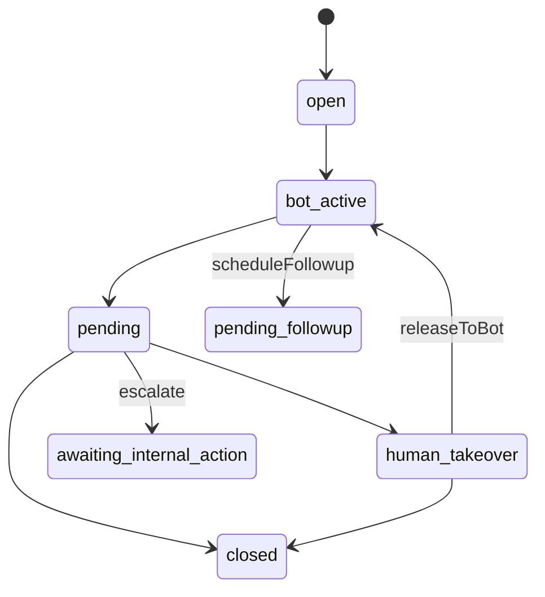

# Conversation state machine / حالات المحادثة

## Status values (technical)

`ChatConversationStatus` in [`lib/types/chat.ts`](../lib/types/chat.ts):

- `open`, `pending`, `bot_active`, `human_takeover`, `closed`
- `awaiting_customer_reply`, `awaiting_internal_action`, `pending_followup`

## New operational fields

- `department` — routing bucket (e.g. confirmation / shipping).
- `automationPausedReason` — optional pause explanation for staff.

## API transitions

`PATCH /api/inbox/conversations/:id` supports:

- `assignedUserId` — emits `conversation.assigned`; if reassigning from a previous owner, also emits `conversation.transferred`.
- `takeOver` / `releaseToBot`
- `escalate: { department, reason? }` — sets `awaiting_internal_action`, emits `conversation.escalated`
- `scheduleFollowup: true` — sets `pending_followup`, emits `conversation.followup_scheduled`
- `automationPausedReason`

## OMS timeline events

Prefer `oms_events` rows for automation/analytics (no heavy subcollection by default):

- `conversation.assigned`, `conversation.transferred`, `conversation.escalated`, `conversation.followup_scheduled`, `conversation.needs_human`

## Operational (AR)

- **التصعيد**: يعطّل البوت تلقائياً عبر تحديث الحالة ويُرسل حدثاً إلى n8n للتوجيه.
