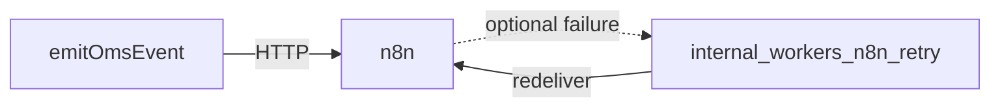

# n8n workflows / تكامل n8n

## Reference export

Example workflow JSON (adjust URLs/secrets per environment):

- [`workflows/n8n-store-oms-whatsapp-bridge.json`](../workflows/n8n-store-oms-whatsapp-bridge.json)

## Inbound contract (technical)

n8n receives `POST` JSON payloads from `emitOmsEvent` → `sendToN8n`:

- Header `X-OMS-Signature: HMAC-SHA256(hex)` when `n8nWebhookSecret` or `N8N_HMAC_SECRET` is set.
- Body includes `event`, `tenantId`, optional `conversationId`, `orderId`, `messageId`, `occurredAt`, `metadata` (includes `correlationId`).

## Outbound calls from n8n → OMS

Typical secured routes:

| Endpoint | Secret |
|----------|--------|
| `POST /api/internal/automation/send-template` | `AUTOMATION_SECRET` |
| `POST /api/internal/automation/classify-reply` | `AUTOMATION_SECRET` |
| `POST /api/internal/automation/order-confirmation` | `AUTOMATION_SECRET` |

## Queue-backed template send

When `WHATSAPP_OUTBOUND_QUEUE=1` and QStash is configured, `send-template` **enqueues** work to `/api/internal/workers/whatsapp-outbound` with `dedupeKey` idempotency.

## Operational (AR)

- **لا تخزن أسرار n8n في الواجهة**؛ تبقى في إعدادات المستأجر أو متغيرات الخادم.
- عند فشل التسليم: راجع `automation_runs` و `automation_dlq` و `oms_events.retryCount`.

