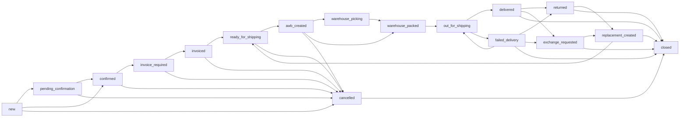

# Orders Workflow

This document describes the production-grade orders pipeline: the 17-status state machine, role-based actions, the activity log shape, filtering API, the migration runbook, and the checklist for adding a new status.

The single source of truth for status metadata lives in [`lib/logic/order-status-meta.ts`](../lib/logic/order-status-meta.ts). The FSM lives in [`lib/logic/order-state-machine.ts`](../lib/logic/order-state-machine.ts). High-level user-facing actions live in [`lib/logic/order-actions.ts`](../lib/logic/order-actions.ts).

## 1. Status table

| Code (English)         | Arabic label                | Bucket          | Allowed roles                                | Gates                          |
| ---------------------- | --------------------------- | --------------- | -------------------------------------------- | ------------------------------ |
| `new`                  | جديد                        | intake          | admin, moderator, confirmation               | —                              |
| `pending_confirmation` | بانتظار التأكيد              | confirmation    | admin, moderator, confirmation               | —                              |
| `confirmed`            | مؤكد                        | confirmation    | admin, moderator, confirmation               | —                              |
| `cancelled`            | ملغي                        | cancelled       | admin, moderator, confirmation, support      | requires `note`                |
| `invoice_required`     | بانتظار الفاتورة             | invoicing       | admin, moderator, confirmation               | —                              |
| `invoiced`             | تمت الفوترة                  | invoicing       | admin, moderator, invoicing                  | invoice number prompt          |
| `ready_for_shipping`   | جاهز للشحن                  | shipping_prep   | admin, moderator, invoicing, warehouse       | invoice required               |
| `awb_created`          | تم إنشاء بوليصة الشحن        | shipping_prep   | admin, moderator, warehouse                  | invoice required               |
| `warehouse_picking`    | جاري التجهيز في المخزن       | warehouse       | admin, moderator, warehouse                  | invoice + AWB required         |
| `warehouse_packed`     | تم التغليف                   | warehouse       | admin, moderator, warehouse                  | invoice + AWB required         |
| `out_for_shipping`     | خرج للشحن                   | in_transit      | admin, moderator, warehouse                  | invoice + AWB required         |
| `delivered`            | تم التسليم                  | delivered       | admin, moderator, warehouse, support         | invoice + AWB required         |
| `failed_delivery`      | فشل التسليم                 | in_transit      | admin, moderator, warehouse, support         | invoice + AWB required, `note` |
| `returned`             | تم الإرجاع                  | returns         | admin, moderator, support, warehouse         | auto-creates a return ticket   |
| `exchange_requested`   | طلب استبدال                 | returns         | admin, moderator, support                    | auto-creates an exchange ticket|
| `replacement_created`  | تم إنشاء بدل                | returns         | admin, moderator, support, warehouse         | —                              |
| `closed` *(terminal)*  | مغلق                        | closed          | admin, moderator                             | —                              |

`postInvoice = true` flag in `ORDER_STATUS_META` drives the invoice gate. AWB requirement is keyed off the warehouse statuses inside `statusRequiresAwb()`.

## 2. State machine (mermaid)



> Cancellation is only allowed up to and including `awb_created`. Once the warehouse takes physical custody (`warehouse_picking` and beyond) the only forward branches are out-for-shipping → delivered/failed_delivery → returns/exchange/closed.

## 3. Activity log structure

Every status change is recorded through `logOrderStatusChange()` in [`lib/services/activity.service.ts`](../lib/services/activity.service.ts). The orchestrator (`transition()` in [`lib/services/orders.service.ts`](../lib/services/orders.service.ts)) is the only callsite that should create these entries.

```jsonc
{
  "id": "act_abc123",
  "tenantId": "tnt_demo",
  "entityType": "order",
  "entityId": "ord_123",
  "userId": "usr_42",
  "action": "order.status.invoiced",
  "timestamp": "2026-04-24T11:00:00.000Z",
  "metadata": {
    "from": "invoice_required",
    "to": "invoiced",
    "role": "invoicing",
    "note": "تم إصدار فاتورة بنفس اليوم",
    "invoiceNumber": "INV-2026-04-101"
  }
}
```

Free-form `extra` fields (e.g. `invoiceNumber`, `cancelReason`, `awb`) come from the orchestrator depending on the action. Notes are trimmed and capped at 2000 chars.

## 4. Action catalogue

`lib/logic/order-actions.ts` exposes:

```ts
availableActions(order, subject) // [{ id, toStatus, label_ar, label_en, permission, ... }]
assertActionAllowed(order, actionId, subject)
ticketTypeForStatus(status)
```

Every UI surface (Kanban card menu, table row, detail page action bar) iterates `availableActions()` and renders only entries whose FSM + RBAC + invoice + AWB gates pass for the current order. The same helper feeds the API hard-gate via `assertActionAllowed()`.

## 5. Filters & search

`GET /api/orders` query parameters:

| Param        | Description                                                          |
| ------------ | -------------------------------------------------------------------- |
| `status`     | Comma-separated list of `OrderStatus` values                         |
| `payment`    | One of `paid`, `unpaid`, `partial`, `cod`                            |
| `shipping`   | `ShipmentStatus` (`pending`, `created`, `packed`, `shipped`, …)       |
| `assignedTo` | User id of the assignee                                              |
| `from`, `to` | ISO yyyy-mm-dd date window over `createdAt`                          |
| `q`          | Free-text search across order id, customer, phone, email             |
| `cursor`     | Pagination cursor returned by the previous response                  |
| `limit`      | Max 100; defaults to 20                                              |

The Orders page UI exposes:

- Kanban swimlane strip (drag-and-drop, role/invoice/AWB-aware) → `POST /api/orders/transition`.
- Multi-select status pills aligned to the active bucket (or full pipeline when "All" is selected).
- Quick-tabs per pipeline bucket (intake / confirmation / invoicing / shipping_prep / warehouse / in_transit / delivered / returns / cancelled).
- Payment + shipping + assignee dropdowns, date presets, and search input.
- A toggle to hide the Kanban strip when only the table is needed.

## 6. Migration runbook

The migration is idempotent and re-runnable.

### Map

| Legacy value          | Replacement           |
| --------------------- | --------------------- |
| `invoicing`           | `invoiced`            |
| `ready_for_warehouse` | `ready_for_shipping`  |
| `packed`              | `warehouse_packed`    |
| `shipped`             | `out_for_shipping`    |
| `follow_up`           | `failed_delivery`     |

`pending_confirmation`, `confirmed`, `delivered`, and `cancelled` stay as-is.

### Run via CLI (single tenant)

```sh
pnpm tsx scripts/migrate-order-statuses.ts --tenant=tnt_demo --dry-run
pnpm tsx scripts/migrate-order-statuses.ts --tenant=tnt_demo
```

`--dry-run` prints the JSON report without writing anything.

### Run via API (admin only)

```sh
curl -X POST https://<host>/api/admin/migrate-order-statuses \
  -H "x-tenant-id: tnt_demo" \
  -H "Authorization: Bearer <id-token>" \
  -d '{"dryRun":true}'
```

The route is gated by `page:admin`. Cross-tenant invocations are blocked by design.

### What the migration touches

1. `orders.status` — every legacy value is rewritten and an `order.status.migrated` activity entry is appended per affected document.
2. `tenant_settings.kanban.columns[].statuses[]` — same map.
3. `tenant_settings.outboundWebhooks[].statuses[]` — same map.
4. `tenant_order_stage_stats` — fully rebuilt for every tenant that had any change.

### Idempotency

`mapLegacyStatus()` is a pure function: docs already on the new model are untouched. The migration only writes when an array contains a known legacy value (`arrayNeedsMigration`). The unit tests in [`scripts/migrate-order-statuses.test.ts`](../scripts/migrate-order-statuses.test.ts) cover the mapping, the array helper, and the unknown-value fallthrough.

## 7. How to add a new status

When introducing a new status, update each of the following in this order to keep the system consistent:

- [ ] Add the code-name to the `OrderStatus` union in [`lib/types/models.ts`](../lib/types/models.ts) and the `ORDER_STATUSES` const array.
- [ ] Add a `OrderStatusMetaEntry` in [`lib/logic/order-status-meta.ts`](../lib/logic/order-status-meta.ts) (label_en, label_ar, tone, bucket, allowedRoles, postInvoice/terminal flags).
- [ ] Update the `ALLOWED` map in [`lib/logic/order-state-machine.ts`](../lib/logic/order-state-machine.ts) with edges in/out of the new status; reflect any new gating in `assertTransitionAllowed`.
- [ ] If it is a warehouse stage, update [`lib/logic/order-state-machine-warehouse.ts`](../lib/logic/order-state-machine-warehouse.ts).
- [ ] Add Arabic + English UI strings in [`lib/i18n/dictionaries.ts`](../lib/i18n/dictionaries.ts).
- [ ] If it is a Kanban-visible stage, add it to a column in [`lib/kanban/column.ts`](../lib/kanban/column.ts) defaults.
- [ ] If it should appear on the dashboard, add the key to [`lib/logic/dashboard-order-stages.ts`](../lib/logic/dashboard-order-stages.ts).
- [ ] Add a mapping case in [`lib/logic/woocommerce-status-map.ts`](../lib/logic/woocommerce-status-map.ts) and extend its tests.
- [ ] If a high-level user action lands on the new status, add an `OrderActionDef` to [`lib/logic/order-actions.ts`](../lib/logic/order-actions.ts) and its corresponding RBAC `Permission` in [`lib/auth/rbac.ts`](../lib/auth/rbac.ts).
- [ ] Update the FSM tests in [`lib/logic/order-state-machine.test.ts`](../lib/logic/order-state-machine.test.ts) (happy paths + illegal jumps + gates).
- [ ] If existing data may carry the new status with a different name, extend [`scripts/migrate-order-statuses.mapping.ts`](../scripts/migrate-order-statuses.mapping.ts) and add a test case.
- [ ] Update this document.
