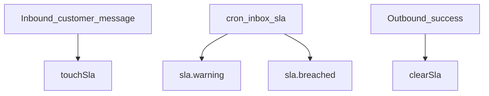

# SLA engine / محرك SLA للصندوق الوارد

## Tenant settings (technical)

On `TenantAutomationSettings`:

- `inboxSlaFirstResponseMinutes` — first response timer after **customer** inbound message (`0` disables).
- `inboxSlaCustomerIdleHours`, `inboxSlaInternalActionHours` — reserved for follow-up / internal SLAs (fields exist; extend scans incrementally).

## Conversation fields

- `slaFirstResponseDueAt`, `slaWarningSentAt`, `slaBreached`, `slaBreachedAt`
- Optional `slaResolutionDueAt` on model for future resolution SLA.

## Wiring

- **Start timer**: `touchSlaOnInboundCustomerMessage` after each successful inbound customer message (`whatsapp-webhook-processor`).
- **Clear timer**: `clearSlaOnStaffOutbound` after successful outbound WhatsApp send (staff send, automation template, order confirmation template).

## Cron

- `GET` or `POST` `/api/cron/inbox-sla` — Bearer `CRON_SECRET` in production.
- QStash-signed: `POST /api/internal/cron/inbox-sla`.

Implementation: [`lib/services/chat/conversation-sla.service.ts`](../lib/services/chat/conversation-sla.service.ts) (`runGlobalInboxSlaCron`).

## Events

- `sla.warning` — approaching breach window
- `sla.breached` — first-response breach; may flip conversation toward human queue

## Operational (AR)

- **جدولة Vercel**: اضبط Cron ليطلب `/api/cron/inbox-sla` كل 1–2 دقائق مع ترويسة `Authorization`.
- **بدون Cron**: لن تُرسل تحذيرات/تجاوزات تلقائياً حتى يعمل المسار المجدول.

## Firestore indexes

Warning scan uses composite range on `slaFirstResponseDueAt` — ensure deployed indexes match [`firestore.indexes.json`](../firestore.indexes.json).

## Troubleshooting

| Issue | Fix |
|-------|-----|
| SLA never starts | Confirm inbound path calls `touchSlaOnInboundCustomerMessage` |
| SLA never clears | Confirm outbound success paths call `clearSlaOnStaffOutbound` |
| No warnings | Cron not scheduled or `inboxSlaFirstResponseMinutes` is `0` |
