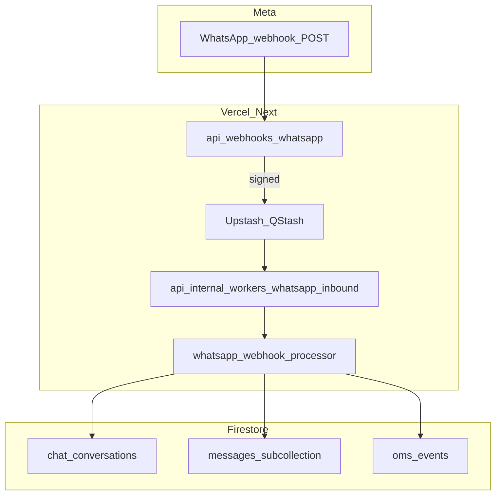

# WhatsApp architecture (technical) / بنية واتساب

**English identifiers, Arabic operational notes.**

## Overview

The OMS remains the **source of truth**. WhatsApp Cloud API handles ingress/egress; **n8n** is **orchestration only** (workflows react to signed HTTP payloads).

## Operational (AR)

- **تأكيد سريع للويبهوك**: عند تفعيل QStash يتم الرد `200` فوراً ثم المعالجة على عامل داخلي لتقليل مهلة Meta.
- **عزل المستأجر**: كل مسار يمر بـ `tenantId` من استعلام `?tenant=` أو من سياق الجلسة للواجهات.
- **الوسائط**: لا يُعرض توكن واتساب في المتصفح؛ التحميل عبر `GET /api/whatsapp/media` مع جلسة الموظف وربط اختياري `conversationId` + `messageId`.

## Troubleshooting

| Symptom | Check |
|--------|--------|
| Webhook 401 | `X-Hub-Signature-256` vs tenant `appSecret` / `WHATSAPP_APP_SECRET` |
| No inbox rows | Phone normalisation + `chat_conversations` indexes |
| n8n not firing | `whatsappAutomationEnabled`, `n8nWebhookUrl`, `oms_events.deliveryStatus` |

## Related docs

- [automation-events.md](./automation-events.md)
- [queue-architecture.md](./queue-architecture.md)
- [sla-engine.md](./sla-engine.md)
